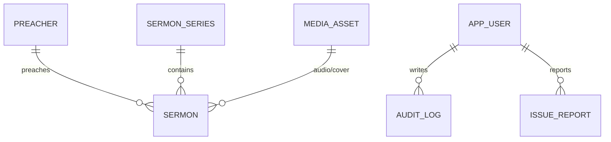

# Domain Model

Forge's PostgreSQL database is the **source of truth**. Every table has `id UUID`, `created_at`, `updated_at` and `version` (optimistic locking plus the sync version).

## Website content (synced to Heritage when published)

| Entity | Key fields |
|---|---|
| `Preacher` | name, slug, title (Pastor/Elder/Guest), bio, photo |
| `SermonSeries` | title, slug, description, cover image, start/end date |
| `Sermon` | title, slug, preached_on, service (MORNING/EVENING/BIBLE_HOUR/OTHER), preacher, series, scripture_book (canonical), scripture_ref, summary, audio (MediaAsset), video_url, duration_seconds, published |
| `Event` | title, slug, starts_at, ends_at, all_day, location, description (md), cover, recurrence (NONE/WEEKLY/MONTHLY) + until, ministry (optional), published |
| `Page` | slug, title, body (md), section (ABOUT/RESOURCES/CONTACT/OTHER), sort_order, published. Pages: A Brief History, 1689 Baptist Confession, Potchefstroom Church Plant, Bible Hour, Do you need a lift?, Privacy notice |
| `Faq` | question, answer (md), sort_order, published |
| `Person` | name, category (LEADERSHIP/OFFICE_STAFF), office (PASTOR/ELDER/DEACON for leadership), role_title (for staff, e.g. Church Administrator), bio, photo, public_email, consent_at, consent_by, sort_order, published |
| `Ministry` | name, slug (growth-groups/young-adults/womens-ministry/mens-ministry), description (md), meeting info, contact, contact_public, image, sort_order, published |
| `BlogPost` | title, slug, author, excerpt, body (md), cover image, tags, published_at, published |
| `Document` | title, slug, category (CREED/CONFESSION/CATECHISM/OTHER), year/origin, summary, body (md, optional), pdf (MediaAsset, optional), sort_order, published |
| `GivingFund` | name, slug (general/new-church-building-fund/church-planting-fund), description (md), account_name, bank, branch_code, account_number, account_type, payment_reference, snapscan_url, snapscan_qr (MediaAsset), target_amount, raised_amount, show_progress, sort_order, published |
| `GrowthGroup` | name, area, host, day_of_week, time, contact, contact_public, active |
| `ServiceTime` | name, day_of_week, time, notes, active |
| `SiteSettings` (singleton) | church name, address, lat/lng, email, phone, socials, hero headline/image/CTA, footer text |
| `MediaAsset` | storage_key, original_name, content_type, size, sha256, width/height, duration, variants |

## Private (never leaves Forge)

| Entity | Key fields |
|---|---|
| `AppUser` | email, password_hash (BCrypt), display_name, role (ADMIN/EDITOR), enabled, last_login_at |
| `RefreshToken` | user, token_hash, expires_at, revoked |
| `ContactMessage` | category (GENERAL/LIFT_REQUEST), name, email, phone, subject, message, area (lift), service (lift), received_at, handled, handled_by |
| `IssueReport` | reporter, category (BUG/CONTENT/DATA/OTHER), description, page_url, user_agent, status |
| `AuditLog` | actor, action, entity_type, entity_id, at, diff |
| `SyncOutbox` | event_id, kind (EVENT/MEDIA/SNAPSHOT), type, entity_id, payload, attempts, next_attempt_at, last_error, status (PENDING/SENT/DEAD) |

## Rules

- A slug is unique per type, generated from the title and editable.
- Unpublishing or deleting content writes a `DELETE` outbox event. See [Sync Protocol](Sync-Protocol.md).
- Scripture books are stored as canonical names with a Bible-order index for sorting.
