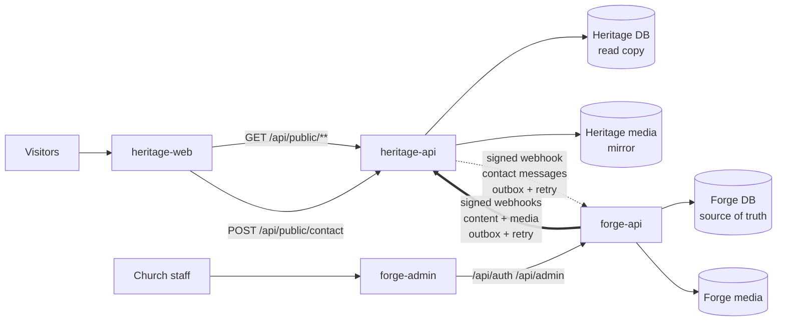

# System Architecture

The Heritage Baptist Church platform is **two repositories, four apps**:

| Repo | App | Stack | Dev port | Role |
|---|---|---|---|---|
| [heritage-website](https://github.com/Malcom-Yingwani/heritage-website) | **heritage-api** | Java 21 · Spring Boot 3 · PostgreSQL | 8080 | Read side. Keeps its **own full copy** of published content and media, and serves every public request from it |
| | **heritage-web** | React · Vite | 5173 | Public website, www.heritagebaptist.co.za |
| [forge-admin](https://github.com/Malcom-Yingwani/forge-admin) | **forge-api** | Java 21 · Spring Boot 3 · PostgreSQL | 8081 | Write side. **Owns all data**, handles staff logins and media uploads, and pushes changes to heritage-api |
| | **forge-admin** | React · Vite | 5174 | Staff admin app (content management), admin.heritagebaptist.co.za |

## The one guarantee

> **If Forge goes down completely, the Heritage website stays up with everything it already had.**

This is the same guarantee the Node MVPs proved, now in Java:

- heritage-api **never calls forge-api to answer a public request**.
- Media (sermon audio, images) is **mirrored** onto Heritage's own storage when it's uploaded, so playback doesn't depend on Forge.
- Forge pushes every change over a **signed webhook**, written to a **transactional outbox** and retried with exponential backoff until Heritage accepts it. See [Sync Protocol](Sync-Protocol.md).
- The reverse path (contact-form messages from Heritage to the Forge inbox) uses the same outbox pattern, so a Forge outage never loses a message.

## What lives where

| Data | Forge (source of truth) | Heritage (read copy) |
|---|---|---|
| Sermons, series, preachers | ✔ | ✔ published only |
| Events, pages, people (leadership, office staff), ministries, growth groups, blog posts, creeds & confessions, giving funds, service times, site settings | ✔ | ✔ published only |
| Media files | ✔ | ✔ mirrored |
| Users, roles, sessions | ✔ | ✘ |
| Contact messages and lift requests | ✔ inbox | ✔ stored briefly until delivered to Forge, then purged after N days |
| Issue reports | ✔ | ✘ |

## Decisions

| # | Decision | Why |
|---|---|---|
| ADR-1 | Java 21 + Spring Boot 3 for both APIs (replacing Node/Express from the MVPs) | Typing, Spring Security, JPA + Flyway, OpenAPI tooling, long-term maintainability |
| ADR-2 | One API per repo: heritage-api (read) and forge-api (write) | Keeps the outage guarantee and lets each side deploy and scale independently |
| ADR-3 | Webhook push with a transactional outbox, plus a manual "full resync" | No polling. Changes are never lost, and a resync repairs any drift |
| ADR-4 | HMAC-SHA256 signed webhooks with a shared secret | Simple, stateless, and works across hosts |
| ADR-5 | PostgreSQL + Flyway on both sides (separate databases) | Nothing shared at runtime |
| ADR-6 | React + Vite for both frontends, sharing `brand.css` tokens | Continuity with the MVPs and one visual language |
| ADR-7 | **Mustard is the primary UI colour** | Works better for interactive UI. See [Brand and Design System](Brand-and-Design-System.md) |
| ADR-8 | A single church (no multi-tenancy) for now | MVP2's `church_id` tenancy can come back later. Keep an `id`-based sync payload so it's easy to add |

## History

`Heritage-ForgeMVP` (private) holds the two Node.js proofs of concept: MVP1 (single tenant) and MVP2 (multi-tenant). This platform is the production rebuild of that design in Java, split into two repositories.
